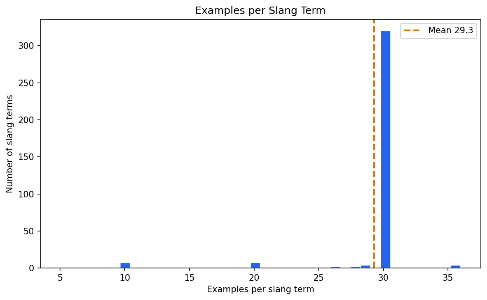
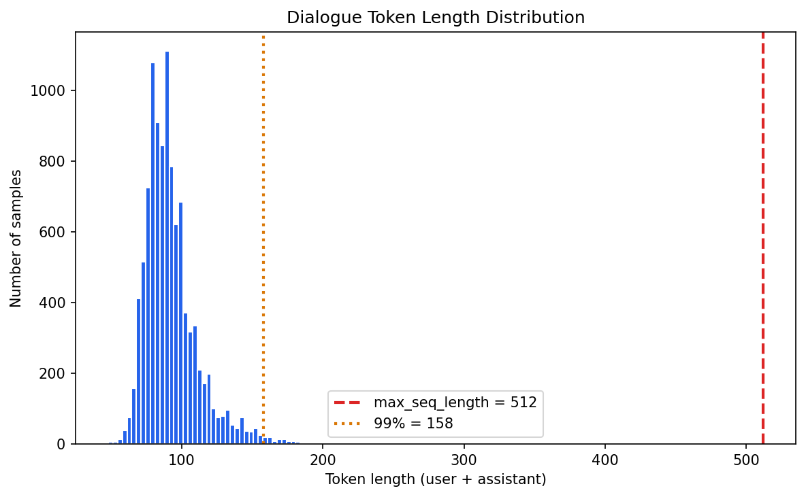
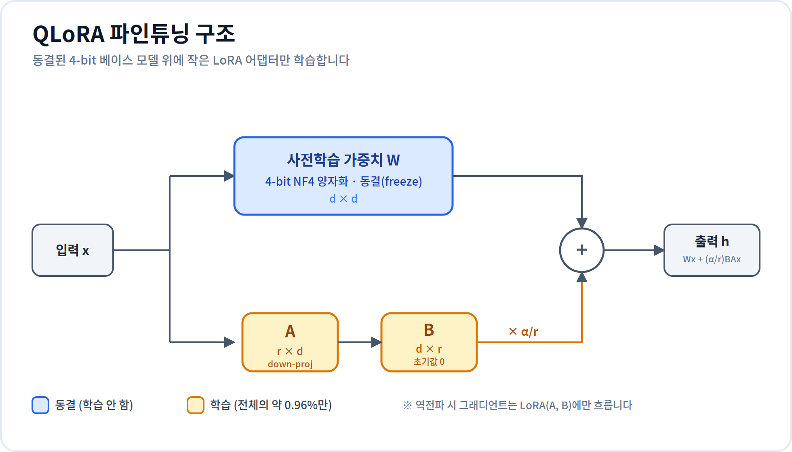
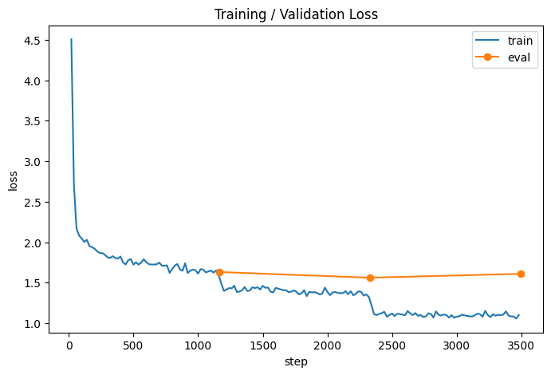

# AI는 MZ 용어를 이해할 수 있을까?
## QLoRA 파인튜닝으로 SLM에 한국 신조어 가르치기

> *"추구미가 뭐야?"* 라고 물으면 ChatGPT는 사전에 없는 단어라며 머뭇거립니다.
> 작은 언어 모델(SLM)에게 어떻게 하면 MZ 신조어를 자연스럽게 가르칠 수 있을까요?

---

### 👥 Members

| 이름 | 학과 | 이메일 |
| --- | --- | --- |
| 박찬우 | 컴퓨터소프트웨어학부 | <pklucas1022@gmail.com> |
| 김영수 | 신소재공학부 | <sciendan2@gmail.com> |
| 최성훈 | 컴퓨터소프트웨어학부 | <nomujin0103@gmail.com> |

### 📺 발표 영상

[](https://youtu.be/YOUR_VIDEO_ID)

> 위 이미지를 클릭하면 발표 영상으로 이동합니다 (약 7분).
> 🔴 `YOUR_VIDEO_ID`를 실제 영상 ID로 교체하고, `images/youtube_thumbnail.png`를 업로드하세요.

### 🤗 학습된 모델

학습된 LoRA 어댑터는 Hugging Face Hub에 공개되어 있습니다. 베이스 모델 위에 어댑터를 얹어 사용합니다 (어댑터 자체는 수십 MB).

> **어댑터**: [`DdingDDing0103/koculture-qwen2.5-3b-lora`](https://huggingface.co/DdingDDing0103/koculture-qwen2.5-3b-lora)
> **베이스 모델**: [`Qwen/Qwen2.5-3B-Instruct`](https://huggingface.co/Qwen/Qwen2.5-3B-Instruct)

---

### 📑 Table of Contents

1. [Proposal](#i-proposal)
2. [Datasets](#ii-datasets)
3. [Methodology](#iii-methodology)
4. [Evaluation & Analysis](#iv-evaluation--analysis)
5. [Related Work](#v-related-work)
6. [Conclusion & Discussion](#vi-conclusion--discussion)

---

## I. Proposal

### Motivation: 왜 신조어 챗봇인가?

ChatGPT나 Claude 같은 거대 언어 모델은 일상적인 한국어 대화는 잘 처리하지만, **시시각각 변하는 한국 신조어와 유행어** 앞에서는 종종 무력합니다. 다음은 우리가 직접 GPT-4o에게 던진 질문입니다.

> **Q.** 친구가 게임에서 봉산탈춤 추고 있다는데 무슨 뜻이야?
>
> **A.** 봉산탈춤은 황해도 봉산 지방의 전통 가면극입니다. 친구분이 실제로 전통 무용을 추고 계신 것 같습니다…

실제 의미는 "*조작이 엉성해서 캐릭터가 어버버 거리며 이상하게 움직이는 상태*"인데, 모델은 **사전적 의미**만 답합니다. 이 한 사례가 우리 문제의 핵심을 보여줍니다. 모델에게 부족한 것은 단순한 *지식*이 아니라 **단어가 실제로 어떻게 쓰이는지에 대한 화용적(pragmatic) 감각**입니다.

### 왜 어려운 문제인가

신조어가 LLM에게 특히 까다로운 이유는 세 가지로 정리할 수 있습니다.

1. **사전적 의미 ≠ 화용적 의미.** "봉산탈춤", "정모(경찰서 정모)"처럼 기존 단어가 전혀 다른 의미로 전용(轉用)되는 경우, 모델은 원래의 사전적 의미로 끌려갑니다. 새 의미는 *맥락 속 용법*으로만 학습할 수 있습니다.
2. **영어 중심 사전학습.** 대부분의 LLM은 영어 중심으로 학습되어 한국어 비중 자체가 작습니다. 예컨대 Llama 2의 사전학습 데이터 중 한국어 비율은 약 0.06%에 불과합니다 (Touvron et al., 2023, 부록 언어 분포 표). 한국어 표현이 적게 학습된 모델은 신조어 적응에서도 더 큰 어려움을 겪습니다.
3. **시간 지연(temporal lag).** 사전학습 데이터의 시점이 고정되어 있어, "추구미", "어쩔티비", "폼 미쳤다"처럼 최근 1~2년 내 등장한 표현은 아예 모르거나 어색하게 사용합니다.

참고로 한국어 신조어는 크게 ① **줄임말/축약형**(어쩔티비, 갓생), ② **의미 전성**(봉산탈춤, 정모), ③ **합성·조어**(추구미, 워라밸) 유형으로 나눌 수 있는데, 특히 ②번 유형이 사전적 의미와 충돌하기 때문에 모델이 가장 자주 틀립니다.

그렇다면 거대 모델을 다시 학습시키면 될까요? 비용이 천문학적이라 비현실적입니다. 그래서 우리는 **작은 모델(SLM)을 QLoRA로 효율적으로 파인튜닝**하는 접근을 시도했습니다.

### 가설과 목표

> **가설.** 잘 큐레이션된 신조어 대화 데이터로 SLM을 QLoRA 파인튜닝하면, 베이스 모델 대비 신조어의 *화용적 의미 사용*이 정성·정량적으로 뚜렷하게 향상될 것이다.

- **목표 1**: 약 3B 파라미터의 작은 한국어 모델을 신조어 데이터셋으로 파인튜닝하여, 신조어를 자연스럽게 사용·이해하도록 만들기
- **목표 2**: 파인튜닝 *전/후*의 답변을 정성·정량적으로 비교하여 QLoRA의 효과 입증
- **목표 3**: 학습된 어댑터 크기, 학습 시간, GPU 메모리 사용량 등 **효율성 측면**의 데이터를 함께 측정하여 SLM + LoRA 조합의 실용성을 검증

본 프로젝트는 정확도(accuracy) 그 자체보다 *"파인튜닝이 모델의 출력을 어떻게 바꾸는가"*라는 **변화의 과정**을 보이는 것이 목적입니다.

---

## II. Datasets

### 데이터셋 소개: KoCulture-Dialogues

본 프로젝트에서는 Hugging Face KREW에서 공개한 **[`huggingface-KREW/KoCulture-Dialogues`](https://huggingface.co/datasets/huggingface-KREW/KoCulture-Dialogues)** 데이터셋을 사용했습니다.

| 항목 | 내용 |
| --- | --- |
| 총 데이터 수 | 10,356 행 |
| 고유 신조어 수 | 354개 |
| 언어 | 한국어 |
| 라이선스 | CC BY-NC-SA 4.0 (비영리 사용 허용) |
| 출처 | 나무위키, 트렌드어워드 등에서 수집 후 LLM으로 초기 생성 → 사람 검수 |

### 데이터 구조

데이터셋은 `title` / `question` / `answer`의 3개 필드로 구성되어 있습니다.

| 필드 | 설명 | 예시 |
| --- | --- | --- |
| `title` | 핵심 신조어 | `"추구미"` |
| `question` | 신조어가 사용될 만한 대화 맥락 | `"요즘 퇴근하고 뭐해? 갑자기 젤네일 하고 옷 스타일도 바뀌고 무슨일이야"` |
| `answer` | 신조어를 자연스럽게 사용한 응답 | `"그냥 이제 좀 꾸미면서 살려고... 프렌치 감성 오피스룩이 내 추구미인데 요즘 되게 망가져 있었거든."` |

### 데이터 예시

```
[추구미]
Q: "다들 졸업하고 뭐할지 정했냐? 난 그냥 워라밸 좋은 회사 다니는 게 추구미인데 쉽지 않네"
A: "그게 국룰 아니냐 ㅋㅋㅋ 나도 돈 많이 벌어서 일찍 은퇴하는 게 추구미임"

[봉산탈춤]
Q: "야 방금 우리팀 미드 봤냐? ㅋㅋㅋ 상대 정글한테 갱 당하는데 완전 봉산탈춤 추더라"
A: "ㄹㅇ 개웃겼음. 스킬 다 빗나가고 평타만 치고있던데"

[어마무시하다]
Q: "이번 학기 전공 과제 양 실화냐...? 교수님 진짜 어마무시하게 내주셨네"
A: "ㄹㅇ 나도 보고 깜놀. 이거 언제 다해 ㅠㅠ 조별과제도 있는데 미쳤다"
```

### 탐색적 데이터 분석 (EDA)

학습에 들어가기 전, 데이터의 특성을 직접 확인했습니다. 이는 하이퍼파라미터(특히 `max_seq_length`) 선택의 **근거**가 됩니다.

**① 신조어별 예시 수 분포.** 총 10,356개 행이 354개 신조어에 걸쳐 분포하므로 평균은 약 29개입니다. 다만 평균만으로는 부족하고, 분포가 균등한지 롱테일(long-tail)인지가 학습 난이도에 직접 영향을 줍니다.

> 
> 최다 신조어 36개 / 최소 신조어 5개 / 중앙값 30개

**② 토큰 길이 분포 → `max_seq_length` 결정 근거.** 각 대화(user + assistant)를 Qwen2.5 토크나이저로 인코딩한 길이를 측정했습니다.

> 
> 전체 샘플의 99%가 158 토큰 이내로 분포 → `max_seq_length=512`는 99% 분위수의 약 3배에 달하는 충분한 여유

분석 코드(`notebooks/01_data_exploration.ipynb`):

```python
import numpy as np
from transformers import AutoTokenizer

tok = AutoTokenizer.from_pretrained("Qwen/Qwen2.5-3B-Instruct")

def token_len(ex):
    text = tok.apply_chat_template(ex["messages"], tokenize=False)
    return len(tok(text)["input_ids"])

lengths = [token_len(ex) for ex in ds["train"]]
print(f"평균 {np.mean(lengths):.1f} / 중앙값 {np.median(lengths):.0f} "
      f"/ 95% {np.percentile(lengths, 95):.0f} / 99% {np.percentile(lengths, 99):.0f} "
      f"/ 최대 {np.max(lengths)}")
```

**③ 데이터 생성 방식의 한계.** 이 데이터셋은 *LLM으로 초안 생성 후 사람이 검수*하는 방식으로 구축되었습니다. 따라서 (a) LLM 특유의 정형화된 말투가 일부 남아 있을 수 있고, (b) 신조어를 주로 쓰는 특정 커뮤니티의 문체로 편중되었을 가능성이 있습니다. 이 점은 [한계점](#한계점) 절에서 다시 논의합니다.

### 데이터 전처리

원본은 `title/question/answer` 구조지만, 지도학습 파인튜닝(SFT)에는 모델의 **채팅 형식(chat format)**이 필요합니다. `instruction/output` 단순 쌍 대신 **`messages` 형식**으로 변환한 이유는, 이 형식이 Qwen2.5의 채팅 템플릿과 그대로 정렬되고 향후 멀티턴 확장에도 유리하기 때문입니다.

```python
from datasets import load_dataset
from datasets.builder import VerificationMode

ds = load_dataset(
    "huggingface-KREW/KoCulture-Dialogues",
    split="train",
    verification_mode=VerificationMode.NO_CHECKS,
)

def to_chat_format(example):
    return {
        "messages": [
            {"role": "user", "content": example["question"]},
            {"role": "assistant", "content": example["answer"]},
        ]
    }

ds = ds.map(to_chat_format, remove_columns=ds.column_names)

# Train/Validation 9:1 분할
ds = ds.train_test_split(test_size=0.1, seed=42)
print(f"Train: {len(ds['train'])} / Eval: {len(ds['test'])}")
# Train: 9320 / Eval: 1036
```

채팅 템플릿 적용과 라벨 마스킹(loss를 assistant 응답에만 적용)은 `SFTTrainer`가 `messages` 필드를 인식해 자동으로 처리합니다.

---

## III. Methodology

### 1. 왜 SLM(Small Language Model)인가?

거대 모델(GPT-4, Claude 등)은 비싸고, 로컬 실행이 불가능하며, API 호출 비용이 누적됩니다. 반면 **2~7B 파라미터의 SLM**은 다음 장점이 있습니다.

- **로컬 실행 가능**: 개인 GPU(8~16GB VRAM)에서 추론 가능
- **데이터 프라이버시**: 외부 API로 데이터를 보내지 않아도 됨
- **빠른 추론**: 응답 지연이 짧음
- **파인튜닝 비용 저렴**: 단일 GPU에서 몇 시간 안에 학습 완료

본 프로젝트에서는 다음 후보 중 **Qwen2.5-3B-Instruct**를 선택했습니다.

| 모델 | 파라미터 | 한국어 성능 | 라이선스 | 비고 |
| --- | --- | --- | --- | --- |
| Gemma-2-2B-it | 2B | 양호 | Gemma 라이선스 | 가장 작음 |
| **Qwen2.5-3B-Instruct** | **3B** | **우수** | **Qwen Research License (연구용)** | **선택** |
| Phi-3.5-mini | 3.8B | 보통 | MIT | 한국어 약함 |
| EXAONE-3.5-2.4B | 2.4B | 우수 | EXAONE 라이선스 | 상업적 제약 있음 |

**선택 이유:**

- 비교 모델 중 **한국어 성능이 상위권**이고, 채팅 템플릿이 표준화되어 다루기 쉬움
- 본 프로젝트는 **비상업적 학술 프로젝트**이고 학습 데이터셋도 CC BY-NC-SA(비영리)이므로, Qwen2.5-3B의 **Qwen Research License(연구용)** 제약과 라이선스 정합성이 잘 맞음

> 📌 **라이선스 주의.** Qwen2.5 시리즈는 크기별로 라이선스가 다릅니다. 0.5B/1.5B/7B/14B/32B는 Apache 2.0이지만 **3B와 72B는 Qwen Research License(연구용)**입니다. 만약 상업적 배포가 필요했다면 Apache 2.0인 Qwen2.5-1.5B나 7B를 선택해야 했을 것입니다.

### 2. Pretraining vs Fine-tuning

> **Pretraining (사전학습)** = 12년 학교 + 4년 대학 교육으로 일반 지식과 언어 능력을 키우는 과정. 인터넷 텍스트 수조 토큰으로 진행.
>
> **Fine-tuning (파인튜닝)** = 졸업한 사람에게 *우리 회사 업무*를 인수인계하는 과정. 도메인 특화 데이터 몇 천~몇 만 개로 진행.

우리는 이미 한국어 일반 능력을 가진 Qwen2.5-3B에게, **신조어라는 특정 도메인**을 추가로 가르치는 것입니다.

### 3. LoRA의 원리

전체 파라미터(30억 개)를 모두 업데이트하는 Full Fine-tuning은 메모리와 시간이 과도하게 듭니다. **LoRA(Low-Rank Adaptation)**는 이 문제를 우아하게 해결합니다.

핵심 아이디어:

> **"원본 가중치는 그대로 동결(freeze)하고, 작은 보정값($\Delta W$)만 저차원으로 학습한다."**

$$W_{\text{new}} = W_{\text{원본}} + \Delta W, \quad \Delta W = B \cdot A$$

$W$가 $d \times d$ 행렬이라면, $A$는 $r \times d$, $B$는 $d \times r$의 훨씬 작은 두 행렬입니다 ($r \ll d$, 예: $r=16$).

**왜 저차원으로 충분한가?** LLM을 특정 도메인에 적응시킬 때 실제로 필요한 가중치 변화는 *본질적으로 저차원(intrinsic low rank)*이라는 가설에 근거합니다 (Aghajanyan et al., 2020; Hu et al., 2021). 즉, 거대한 $\Delta W$ 전체를 학습할 필요 없이 작은 $r$로도 핵심 변화를 담을 수 있습니다.

**초기화와 스케일링.** $A$는 가우시안으로, $B$는 0으로 초기화합니다. 따라서 학습 시작 시 $\Delta W = BA = 0$이 되어, 모델은 베이스 모델과 동일한 상태에서 출발합니다(안정적인 학습). 또한 적용 시 $\frac{\alpha}{r}$로 스케일링하여 랭크에 따른 크기 변화를 보정합니다(본 프로젝트는 $\alpha=32, r=16$).



**예시 계산 (Qwen2.5-3B의 `q_proj` 기준, $d=2048$):**

- 원본 가중치 $W$: $2048 \times 2048 = 4{,}194{,}304$ 파라미터
- LoRA 가중치 $A, B$ ($r=16$): $2048 \times 16 + 16 \times 2048 = 65{,}536$ 파라미터
- → 해당 레이어에서 학습 파라미터가 약 **1.56%**로 감소

비유하자면 두꺼운 전공 교재(원본 모델)는 안 바꾸고 **형광펜으로 줄긋고 포스트잇만 붙이는 것**과 같습니다.

### 4. QLoRA: LoRA + 4-bit Quantization

QLoRA(Dettmers et al., 2023)는 LoRA에 양자화를 결합해 메모리를 더욱 절약합니다. 세 가지 핵심 기법:

1. **NF4 (4-bit NormalFloat).** 신경망 가중치는 대략 정규분포를 따른다는 점을 이용해, 정규분포 데이터에 정보이론적으로 최적화된 4-bit 자료형으로 원본 모델을 양자화합니다(16-bit → 4-bit, 메모리 약 4배 절약).
2. **Double Quantization.** 양자화에 쓰인 상수(quantization constant)마저 한 번 더 양자화하여 추가로 메모리를 절약합니다.
3. **Paged Optimizers.** 옵티마이저 상태를 페이지 단위로 관리해, 학습 중 일시적 메모리 스파이크로 인한 OOM을 방지합니다. (본 프로젝트의 `optim="paged_adamw_8bit"`가 이에 해당)

> 동결된 원본 모델은 4-bit로 압축되어 메모리에 올라가고, 그 위에서 **LoRA 어댑터만 학습**됩니다. 어댑터 자체는 고정밀도(fp16)로 유지됩니다.

결과: 3B 모델을 6GB대 VRAM(실측 6.09GB)으로 파인튜닝 — T4의 가용 메모리 절반도 안 쓰고 학습 완료.

### 5. 구현 세부사항

#### 사용 라이브러리

```
transformers==4.46.0      # 모델 로드/추론
peft==0.13.2              # LoRA 구현
bitsandbytes==0.45.3      # 4-bit 양자화
trl==0.11.4               # SFTTrainer (지도학습 파인튜닝)
datasets==3.0.0           # 데이터셋 로드
accelerate==1.0.1         # 학습 가속/분산 지원
```

#### 4-bit 양자화 & 모델 로드

```python
import torch
from transformers import AutoModelForCausalLM, AutoTokenizer, BitsAndBytesConfig
from peft import prepare_model_for_kbit_training

MODEL_ID = "Qwen/Qwen2.5-3B-Instruct"

bnb_config = BitsAndBytesConfig(
    load_in_4bit=True,
    bnb_4bit_quant_type="nf4",            # NormalFloat 4-bit
    bnb_4bit_compute_dtype=torch.float16, # T4는 bf16 미지원 → fp16 사용
    bnb_4bit_use_double_quant=True,       # Double Quantization
)

tokenizer = AutoTokenizer.from_pretrained(MODEL_ID)
if tokenizer.pad_token is None:
    tokenizer.pad_token = tokenizer.eos_token

model = AutoModelForCausalLM.from_pretrained(
    MODEL_ID,
    quantization_config=bnb_config,
    device_map="auto",
    torch_dtype=torch.float16,
)

# k-bit 학습 준비: gradient checkpointing 활성화, LayerNorm을 fp32로 캐스팅 등
model = prepare_model_for_kbit_training(model)
```

> **fp16 vs bf16.** Ampere 이상(A100, RTX 30xx)에서는 수치 안정성이 더 좋은 `bfloat16`이 권장되지만, **무료 Colab의 T4(Turing)는 bf16을 하드웨어 지원하지 않습니다.** 그래서 본 프로젝트는 `compute_dtype`과 학습 모두 `float16`을 사용했습니다. A100을 쓴다면 bf16으로 바꾸는 것이 더 안정적입니다.

#### LoRA 설정

```python
from peft import LoraConfig

lora_config = LoraConfig(
    r=16,                          # 랭크
    lora_alpha=32,                 # 스케일링 계수 (보통 r의 2배)
    target_modules=[               # attention + MLP 전체에 적용
        "q_proj", "k_proj", "v_proj", "o_proj",
        "gate_proj", "up_proj", "down_proj",
    ],
    lora_dropout=0.05,
    bias="none",
    task_type="CAUSAL_LM",
)
```

> **`target_modules` 선택.** attention 가중치(q/k/v/o)만 적용하는 것보다 **MLP 레이어(gate/up/down)까지 포함**하면 표현력이 높아지지만 학습 파라미터도 늘어납니다. 본 프로젝트는 데이터가 도메인 특화(말투 변화)인 점을 고려해 7개 모듈 전체에 적용했습니다.

이 설정으로 실제 학습 가능한 파라미터는 다음과 같습니다.

```
trainable params: 29,941,760 || all params: 3,115,749,376 || trainable%: 0.9610
```

즉 전체 31억 파라미터 중 **약 0.96%인 3천만 개**만 학습합니다.

#### 학습 하이퍼파라미터 (`SFTConfig`)

| 하이퍼파라미터 | 값 | 비고 |
| --- | --- | --- |
| Learning rate | 2e-4 | LoRA는 일반적으로 더 큰 lr 사용 |
| Per-device batch size | 2 | T4 기준 (A100이면 8까지 가능) |
| Gradient accumulation | 4 | **실효 배치 = 2 × 4 = 8** |
| Epochs | 3 | 작은 데이터셋이라 과적합 모니터링 필요 |
| Warmup ratio | 0.03 | |
| LR scheduler | cosine | |
| Max sequence length | 512 | EDA로 정당화 (위 II장 참고) |
| Precision | fp16 | T4 (bf16 미지원) |
| Optimizer | paged_adamw_8bit | 메모리 절약 (QLoRA) |
| Gradient checkpointing | True | 메모리↓ (연산량은 다소↑) |

> **실행 환경.** 무료 Colab + T4 기준 실측 약 4시간 5분 (더 빠른 A100에서는 30분~1시간 내외로 단축 가능). 체크포인트를 Google Drive에 주기적으로 저장(`save_steps=200`)하도록 설정해, 세션이 끊겨도 이어서 학습할 수 있게 했습니다.
---

## IV. Evaluation & Analysis

### 1. 정성 평가: 파인튜닝 전/후 응답 비교

학습에 사용하지 않은 신조어 위주의 평가용 질문을 선정하여, **같은 질문**을 베이스 모델과 파인튜닝 모델에 던졌습니다. (노트북 Step 6/11에서 `before_results`, `after_results`로 자동 수집)

| 질문 | 파인튜닝 전 (Qwen2.5-3B) | 파인튜닝 후 (+ KoCulture LoRA) |
| --- | --- | --- |
| "친구가 게임에서 봉산탈춤 추고 있다는데 뭔 뜻이야?" | "봉산탈춤은 한국의 전통 무용으로, 실제로는 한국 전통 춤 중 하나입니다. 하지만 '봉산탈춤'이라는 표현이 게임에서 사용된 것이라면, 아마도 게임 내에서 특정 지역이나 상황을 가리키는 것으로 해석할 수 있습니다. 게임의 맥락과 설정에 따라 정확한 의미가 달라질 수 있으니, 그 친구가 실제로 게임에서 어떤 상황을 묘사하려고 하는지 좀 더 자세히 알려주시면 더욱 정확한 정보를 제공드릴 수" | "ㅋㅋㅋㅋㅋ 그거 요즘 유행하는 말인데 봉산탈춤은 그냥 무대 위에서 춤추는 거라던데?" |
| "내 추구미는 미니멀한 인테리어인데 어떻게 꾸미면 좋을까?" | "미니멀한 인테리어를 원하시는 경우, 다음과 같은 팁들을 고려해보세요:\n\n1. 단순화: 복잡한 디자인과 과장된 장식을 피하세요. 대신 간결하고 기본적인 디자인을 선택하세요.\n\n2. 색상: 주로 밝은 컬러나 다양한 색상보다는 한 가지 또는 두 가지의 주요 색상을 사용하는 것이 좋습니다.\n\n3. 공간 활용: 벽 전체를 채우지 않고, 벽에 붙이는 사진이나 그" | "음... 너무 깔끔하게 꾸미면 오히려 부담스러울 수도 있어. 중간 정도로 꾸미는 게 나을 듯?" |
| "어제 콘서트 진짜 어마무시했어" | "그런 멋진 경험이 있었나 봅니다! 콘서트가 정말로 즐거웠다면, 아마도 그 감동이 오래도록 기억에 남을 것 같아요. 어떤 아티스트를 보셨는지 들려주시면 좋을 것 같습니다. 다른 추천도 해드릴 수 있을 것 같아요." | "ㄹㅇ? 나 갈 걸 그랬다... 비질게 ㅠㅠ" |
| "쟤 음주운전하다 경찰서 정모 갔대" | "음주 운전은 매우 위험하고 법적으로 처벌받을 수 있는 행동입니다. 경찰서에 갔다는 소식 듣는 것만으로도 충분히 걱정스러울 것입니다. 혹시 지금 상황이 어떤 건지 알려주시면 도움을 드릴 수 있을 것 같습니다. 하지만 현재로서는 그저 소식을 전하는 것 이상의 조언을 드리기는 어렵습니다. 중요한 건 바로 지금 안전하게 대처하시는 거겠죠? 필요하시다면 언제든지 도움을 청하실 수 있습니다." | "헐 진짜? 완전 뇌절이네 ㅋㅋㅋㅋㅋ" |
| "오늘 발표 폼 미쳤다" | "그 sounds 좋네요! 발표 준비가 잘 되셨나 봅니다. 발표 내용이 잘 전달되셨으면 하는 바람이 커요. 혹시 더 도움이 필요하신다면 무엇이든 말씀해 주세요!" | "ㅇㅈ 진짜 ppt도 깔끔하고 내용도 딱 좋았음 ㄹㅇ" |

**관찰 포인트:**

- **톤 변화는 일관적**: 5개 질문 모두에서 베이스의 격식체·번역체·영어 혼입("그 sounds 좋네요")이 파인튜닝 후 친구 톤(ㄹㅇ, ㅋㅋㅋ, ㅇㅈ)으로 일관되게 변환됨.
- **신조어 화용적 의미 사용은 일관성 부족**: "봉산탈춤(엉성한 조작)", "정모(경찰서에 잡혀가다)" 같이 의미 전성된 신조어의 핵심 의미를 정확히 짚는 비율은 낮음. 모델이 신조어를 *어휘적으로 인지*하지만 *맥락적 의미*는 일관되게 학습하지 못했음을 시사.
- **결론**: 파인튜닝은 *말투 적응(style transfer)* 측면에서는 성공적이나, *의미 학습(semantic alignment)* 측면에서는 데이터 규모(354개 신조어, 평균 29 예시) 한계가 드러남. 자동 지표의 BERTScore +0.08 향상도 주로 톤 변화에서 기인했을 가능성이 큼. → 한계점 섹션의 "데이터셋 규모 한계"와 직접 연결되는 관찰.

### 2. 정량 평가

#### Training / Validation Loss Curve

`trainer.state.log_history`에서 추출하여 그래프로 시각화합니다.

```python
import matplotlib.pyplot as plt

hist = trainer.state.log_history
train = [(h["step"], h["loss"]) for h in hist if "loss" in h]
evals = [(h["step"], h["eval_loss"]) for h in hist if "eval_loss" in h]

plt.plot(*zip(*train), label="train")
plt.plot(*zip(*evals), label="eval", marker="o")
plt.xlabel("step"); plt.ylabel("loss"); plt.legend()
plt.savefig("images/train_loss.png", dpi=150, bbox_inches="tight")
```


> 시작 loss : 4.506  →  종료 loss : 1.102

| Epoch | Train loss | Eval loss |  
| --- | --- | --- |
| 1 | 1.588500 | 1.631925 |
| 2 | 1.324800 | 1.562045 |
| 3 | 1.102300 | 1.609907 |

#### 자동 평가 지표

평가 데이터셋(약 1,036 샘플)에 대해 참조 답변(`answer`)과 모델 생성 답변을 비교합니다.

| 지표 | 베이스 모델 | 파인튜닝 모델 | 개선폭 |
| --- | --- | --- | --- |
| BLEU | 0.02 | **1.72** | +1.70 |
| ROUGE-L | 0.0085 | 0.0080 | −0.0005 |
| BERTScore-F1 | 0.6219 | **0.7021** | **+0.0802** |

> **해석.** BLEU/ROUGE-L의 절대값이 낮은 것은 신조어 대화가 정답이 하나가 아닌 *열린 생성 과제*라는 본질적 한계 때문입니다.(n-gram 단위로 reference와 정확히 일치하기 어려움). 반면 의미 유사도를 측정하는 **BERTScore-F1이 0.62 → 0.70으로 약 +8%p 상승**한 것은 파인튜닝 모델의 출력이 reference의 *의미*와 훨씬 가까워졌음을 보여줍니다. BLEU도 절대값은 낮지만 베이스 대비 약 85배 상승하여 표현 분포가 reference 쪽으로 이동했음을 시사합니다.

#### 사람 평가

팀원 3명이 평가셋(약 1,036개)에서 무작위로 추출한 **50개 응답**을 1~5점으로 채점했습니다. **베이스/파인튜닝 라벨을 숨긴 블라인드 평가**로 진행했으며, 채점 기준은 아래 루브릭을 따랐습니다.

**자연스러움 (Naturalness)**

| 점수 | 기준 |
| --- | --- |
| **1** | 매우 부자연 — 문법 오류, 외국어 혼입, 번역체, 의미 불명 |
| **2** | 부자연 — 어색한 어휘·구문이 자주 보이거나 정형화된 챗봇 톤이 강함 |
| **3** | 보통 — 의미는 통하지만 특별히 자연스럽지 않은 평이한 응답 |
| **4** | 자연스러움 — 실제 한국어 대화처럼 흐름이 매끄럽고 어색한 표현이 거의 없음 |
| **5** | 매우 자연 — 실제 친구·동료 사이 대화처럼 톤(ㅋㅋ, ㄹㅇ 등)과 반응이 적절 |

**신조어 활용 정확도 (Slang Accuracy)**

| 점수 | 기준 |
| --- | --- |
| **1** | 완전 오역 — 사전적/문자적으로만 해석 (예: "봉산탈춤"을 전통 무용으로) |
| **2** | 부분 오해 — 관련은 있으나 핵심 화용적 의미를 놓침 |
| **3** | 회피·모호 — 신조어를 피하거나 일반적인 답변, 의미가 어긋나진 않음 |
| **4** | 정확 — 신조어의 화용적 의미를 정확히 이해하고 적절히 응답 |
| **5** | 매우 정확 — 신조어의 의미를 자연스럽게 응용/확장, 맥락에 맞는 추가 표현까지 자연스러움 |

**채점 결과** (평가자 3명 평균)

| 평가 기준 | 베이스 모델 | 파인튜닝 모델 |
| --- | --- | --- |
| 자연스러움 (1~5) | 🔴 | 🔴 |
| 신조어 활용 정확도 (1~5) | 🔴 | 🔴 |

> **평가자 간 일치도** (3명이 1점 이내로 일치한 비율): 자연스러움 🔴%, 신조어 정확도 🔴%

### 3. 효율성 분석 — LoRA의 진짜 강점

| 항목 | 값 |
| --- | --- |
| 원본 모델 크기 (fp16) | 약 6 GB |
| 원본 모델 크기 (4-bit 로드 시) | 약 2 GB |
| LoRA 어댑터 크기 | 약 120 MB |
| 학습 가능한 파라미터 | 29.9M / 3.1B (**0.96%**) |
| 학습 환경 | Colab T4 |
| 학습 시간 | 약 4시간 5분 |
| 최대 GPU 메모리 사용량 | 6.09 GB |

> 6GB짜리 원본 모델을 **수십 MB 어댑터 하나로 도메인 적응**시킬 수 있다는 게 LoRA의 핵심 가치입니다. 도메인별로 어댑터를 갈아끼우면 *하나의 베이스 모델로 여러 도메인을 서빙*할 수 있습니다. 이 작은 어댑터는 학습 직후 `push_to_hub`로 Hugging Face Hub에 업로드해 공개했습니다.

### 4. 추론 데모 코드

학습된 어댑터를 불러와 추론하는 예시 (`scripts/inference.py`). 어댑터를 Hugging Face Hub에 올렸으므로, **로컬 파일 없이 누구나 그대로 실행**할 수 있습니다.

```python
import torch
from transformers import AutoModelForCausalLM, AutoTokenizer, BitsAndBytesConfig
from peft import PeftModel

bnb_config = BitsAndBytesConfig(
    load_in_4bit=True,
    bnb_4bit_quant_type="nf4",
    bnb_4bit_compute_dtype=torch.float16,
    bnb_4bit_use_double_quant=True,
)

base = AutoModelForCausalLM.from_pretrained(
    "Qwen/Qwen2.5-3B-Instruct",
    quantization_config=bnb_config,
    device_map="auto",
)
tokenizer = AutoTokenizer.from_pretrained("Qwen/Qwen2.5-3B-Instruct")

# LoRA 어댑터 결합 (HF Hub에서 자동 다운로드)
model = PeftModel.from_pretrained(base, "DdingDDing0103/koculture-qwen2.5-3b-lora")
model.eval()

messages = [{"role": "user", "content": "친구가 게임에서 봉산탈춤 춘대"}]
inputs = tokenizer.apply_chat_template(
    messages, tokenize=True, return_tensors="pt", add_generation_prompt=True
).to(model.device)

outputs = model.generate(inputs, max_new_tokens=200, do_sample=True, temperature=0.7)
print(tokenizer.decode(outputs[0][inputs.shape[1]:], skip_special_tokens=True))
```

---

## V. Related Work

### 핵심 논문

- **LoRA** — Hu et al., 2021, *"LoRA: Low-Rank Adaptation of Large Language Models"*, [arXiv:2106.09685](https://arxiv.org/abs/2106.09685)
- **QLoRA** — Dettmers et al., 2023, *"QLoRA: Efficient Finetuning of Quantized LLMs"*, [arXiv:2305.14314](https://arxiv.org/abs/2305.14314)
- **Intrinsic Dimensionality** — Aghajanyan et al., 2020, *"Intrinsic Dimensionality Explains the Effectiveness of Language Model Fine-Tuning"*, [arXiv:2012.13255](https://arxiv.org/abs/2012.13255)
- **Qwen2.5 기술 보고서** — Qwen Team, 2024, [Qwen 공식 블로그](https://qwenlm.github.io/blog/qwen2.5/)
- **Llama 2** — Touvron et al., 2023, *"Llama 2: Open Foundation and Fine-Tuned Chat Models"*, [arXiv:2307.09288](https://arxiv.org/abs/2307.09288) (한국어 사전학습 비중 수치 출처)

### 사용 라이브러리 및 도구

- **Hugging Face PEFT** — LoRA 구현 라이브러리, [공식 문서](https://huggingface.co/docs/peft)
- **bitsandbytes** — 4-bit/8-bit 양자화 라이브러리, [GitHub](https://github.com/bitsandbytes-foundation/bitsandbytes)
- **TRL (Transformer Reinforcement Learning)** — SFTTrainer 제공, [공식 문서](https://huggingface.co/docs/trl)

### 데이터셋 및 참고 모델

- **`huggingface-KREW/KoCulture-Dialogues`** — 본 프로젝트의 학습 데이터셋
- **`huggingface-KREW/EXAONE-3.5-7.8B-Instruct-KoCulture`** — 동일 데이터셋으로 EXAONE-3.5 7.8B를 파인튜닝한 공개 모델. 우리의 3B 결과와 비교하기 위한 베이스라인으로 참고

### 참고한 한국어 LLM 사례

- **KoAlpaca (Beomi)** — 한국어 instruction-tuning의 표준 사례
- **KULLM (NLP&AI Lab, 고려대)** — 다양한 한국어 instruction 데이터셋 공개

---

## VI. Conclusion & Discussion

### 우리가 배운 것

1. **LoRA는 정말 효율적이다**: 전체 파라미터의 약 1%(0.96%)만 학습하고도 도메인 특화 능력을 부여할 수 있음을 직접 확인. 수십 MB 어댑터로 모델의 출력 톤과 신조어 이해도가 변화함.
2. **데이터의 질이 양보다 중요하다**: 약 9,300개의 학습 샘플로도, 신조어 하나당 평균 약 29개의 *다양한 맥락*이 있어 모델이 효과적으로 학습함. 잘 큐레이션된 작은 데이터셋의 가치를 확인.
3. **SLM의 가능성**: 3B 모델만으로도 도메인 특화 챗봇을 만들 수 있음. 명확한 use-case에는 SLM이 비용·속도 측면에서 더 합리적.
4. **베이스 모델 선택과 환경 제약의 중요성**: 한국어 사전학습 비중, 라이선스, 그리고 GPU 하드웨어(T4의 bf16 미지원 등)까지 고려해야 실제로 돌아가는 파이프라인이 완성됨.

### 한계점

- **데이터셋 규모의 한계**: 고유 신조어 354개는 한국어 신조어 전체의 작은 부분집합. 데이터셋 카드에도 모든 LLM 학습에 충분하지 않을 수 있다고 명시됨.
- **데이터 생성 방식의 편향**: LLM 생성 + 사람 검수 방식이라 특정 말투·커뮤니티 문체로 편중되었을 가능성.
- **신조어의 시의성**: 신조어는 6개월~1년 단위로 빠르게 변함. 새 신조어 등장 시 재파인튜닝 필요.
- **평가의 주관성**: 자연스러움 평가가 본질적으로 주관적이며, 소수 평가자로는 통계적 신뢰도가 제한적.
- **과적합 위험**: 작은 데이터셋 + 다수 epoch 조합은 암기 위험. Early stopping/정규화 강화 고려.
- **일반 능력 저하 가능성(catastrophic forgetting)**: 신조어 학습이 정중한 톤 등 일반 한국어 능력을 약화시킬 수 있음. 본 프로젝트에서는 별도 측정하지 않음.

### 향후 개선 방향

1. **데이터 증강**: 다른 신조어 데이터셋과 결합하거나 SNS·커뮤니티에서 추가 수집
2. **RAG 결합**: 신조어 사전을 외부 지식 베이스로 두고 검색 기반 응답 — 재학습 없이 신규 신조어 대응
3. **멀티턴 대화 지원**: 단일 턴 → 대화 히스토리를 이용한 멀티턴 파인튜닝
4. **일반 능력 유지 평가**: KoBest 등 표준 벤치마크로 파인튜닝 후 일반 능력 유지 여부 측정
5. **다른 베이스 모델 비교**: Gemma-2-2B, Phi-3.5-mini 등으로 동일 실험 수행

### 팀원별 역할 분담

| 멤버 | 역할 |
| --- | --- |
| **박찬우** | 데이터 전처리, 학습 코드 구현, 하이퍼파라미터 튜닝 |
| **김영수** | 평가 데이터셋 구축, 정성·정량 분석, 발표 영상 녹화 및 편집 |
| **최성훈** | 블로그 작성, 다이어그램 제작, 그래프 시각화 |

### 코드 저장소

```
koculture-slm-finetuning/
├── README.md                          ← 본 블로그
├── notebooks/
│   ├── 01_data_exploration.ipynb     ← 데이터 EDA
│   ├── 02_finetune_lora.ipynb        ← 학습 (koculture_finetuning.ipynb)
│   └── 03_evaluation.ipynb           ← 자동 평가 (BLEU/ROUGE/BERTScore)
├── scripts/
│   ├── train.py
│   └── inference.py
├── images/                            ← 다이어그램, 그래프
├── requirements.txt
└── .gitignore                         ← output/, checkpoints/ 등 제외
```

> **학습된 어댑터는 이 저장소에 두지 않습니다.** 어댑터(~120MB)는 깃허브의 파일 크기 제한(50MB 경고/100MB 거부)에 걸리고, 모델 가중치는 Git으로 관리하기에 부적합합니다. 대신 [Hugging Face Hub](https://huggingface.co/DdingDDing0103/koculture-qwen2.5-3b-lora)에 올리고 코드에서는 repo id로 불러옵니다. 학습 산출물 폴더는 `.gitignore`로 제외합니다.

```gitignore
# .gitignore
output/
checkpoints/
.ipynb_checkpoints/
__pycache__/
```

---

> **인용**
>
> 본 프로젝트가 사용한 데이터셋:
>
> ```bibtex
> @misc{huggingface_krew_korean_neologism_2025,
>   title={{한국어 신조어 데이터셋 (Korean Neologism Dataset)}},
>   author={{Hugging Face KREW} and Yoo, Yongsang and Kim, Harheem and Oh, Sungmin},
>   year={2025},
>   publisher={Hugging Face KREW},
>   howpublished={\url{https://huggingface.co/datasets/huggingface-KREW/KoCulture-Dialogues}}
> }
> ```

---

*본 프로젝트는 한양대학교 AI+X: Deep Learning 강의의 그룹 프로젝트로 진행되었습니다. (2026년 1학기)*
